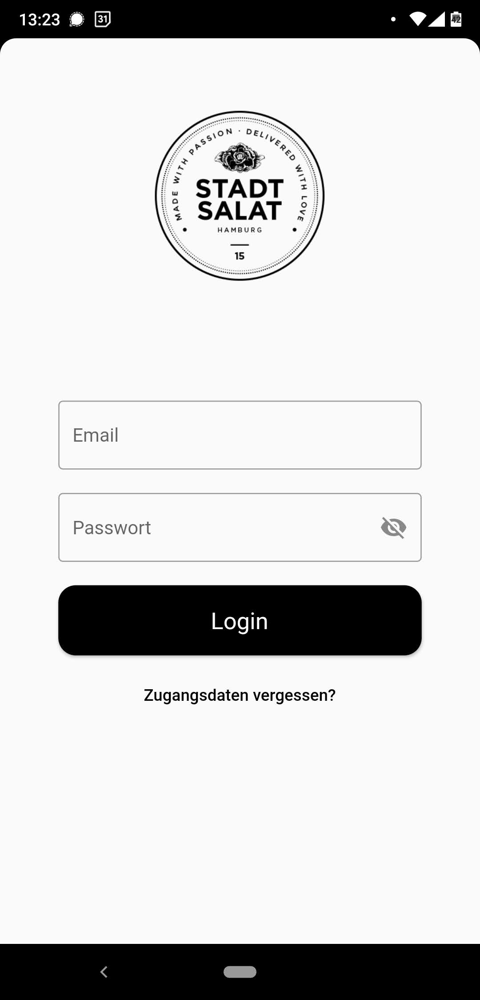
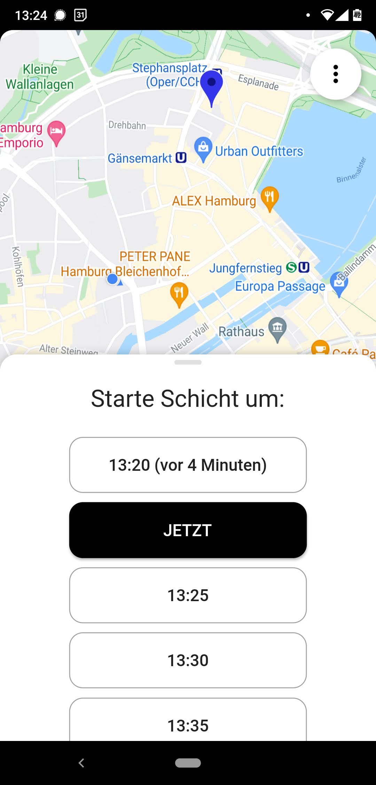
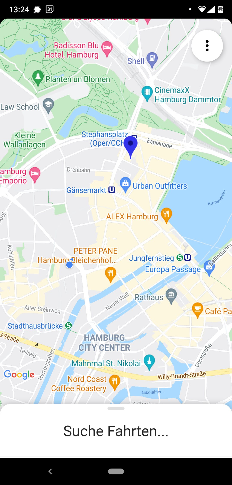
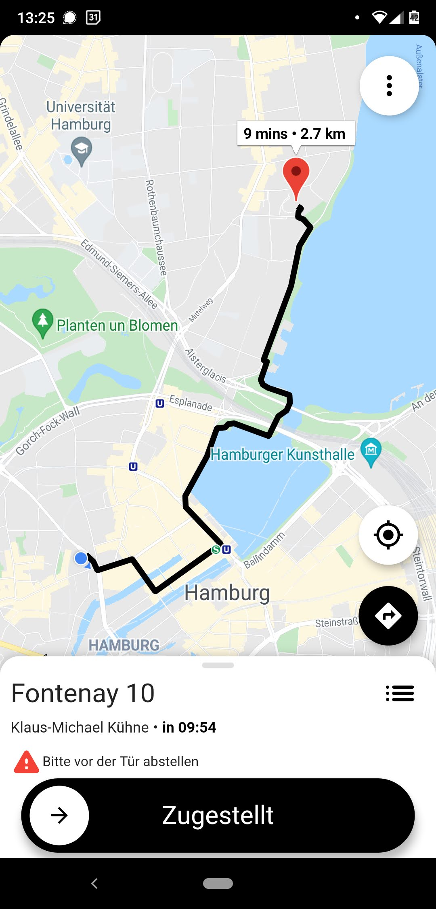
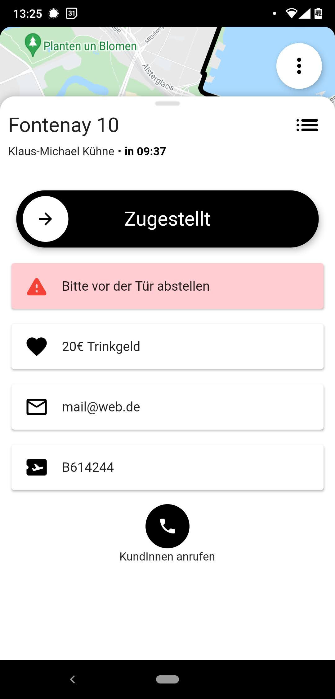
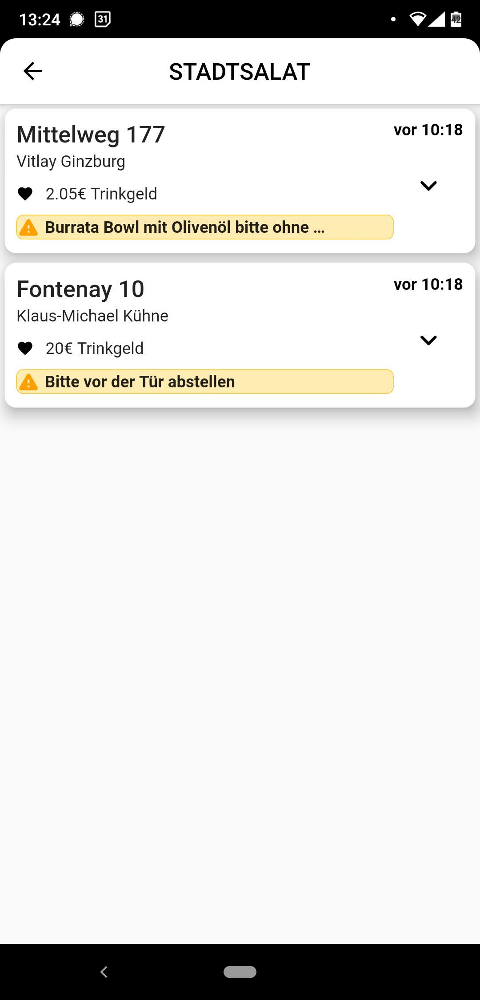
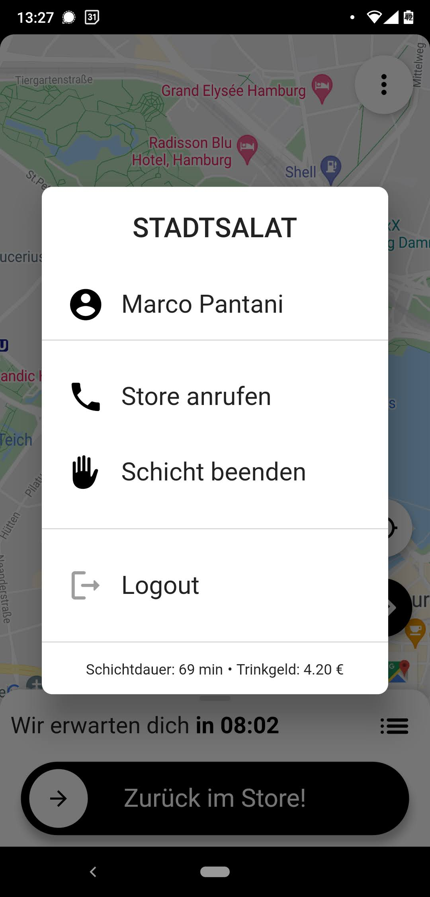
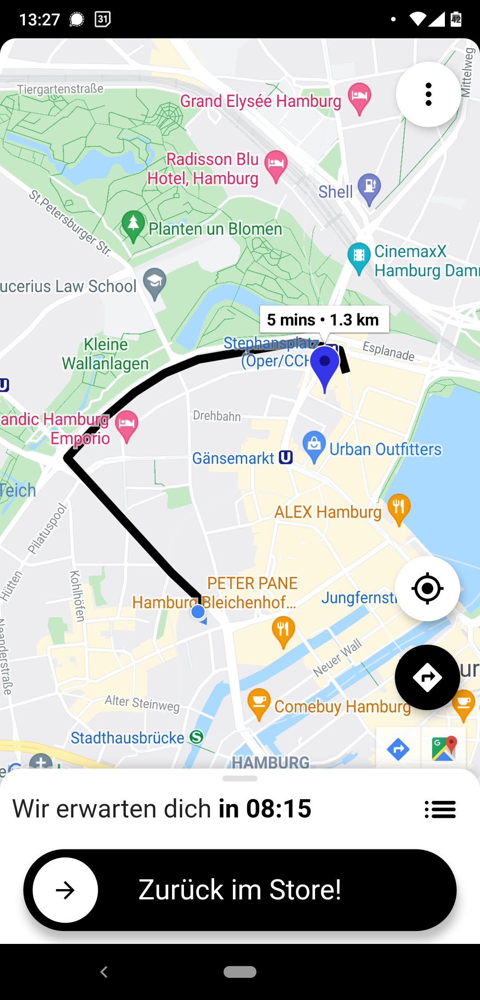

# Cyclopath

A Courrier app that includes functionality that allows the courier to receive orders, view order details, and deliver it crazy fast. "All User Input Equals Error" is the mantra when looking at UX.

## Screenshots

<table>
    <tr>
        <td></td>
        <td></td>
        <td></td>
        <td></td>
    </tr>
    <tr>
        <td></td>
        <td></td>
        <td></td>
        <td></td>
    </tr>
</table>

## Screen recording

## Roadmap

**Must have features:**

- [x] Sign in as a courier
  - [x] Sign out

- [x] Select starting time using bottom sheet
  - [x] Tap to open
  - [x] Drag to open
  - [x] Open to specific height
  - [x] Tap to close
  - [x] Drag to close

- [x] View order details
  - [x] View delivery location
  - [x] View direction on map using flutter_polyline_points
  - [x] Button to start turn-by-turn navigation
  
- [x] View list of orders
  - [x] Build ListTile
  - [x] View order queue with tap on list button  

**Nice to have features:**

- [x] View route preview on order
- [x] Destination window of marker with distance & duration
- [x] Show navigation Button
- [ ] See VerticalProgressIndicator when going online
- [ ] Push-notification
- [ ] Get realtime updates with Cloud Firestore
- [ ] Offline capability using package 'retry'
- [ ] time.periodic remote config
- [ ] Insert sound feature
  - [ ] Delivery sound
- [ ] Blast colorful confetti all over the screen when deliveries complete
- [ ] Automatically change status of user to "waiting" when close to store
- [ ] Make every Map available  
